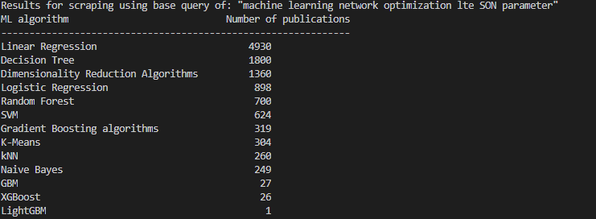

# scholar-results-counter
Small web scraper to quickly evaluate list of ML algorithms against whitepapers using Google Scholar.

## How to use

Modify the QUERY_BASE and ALGORITHM_LIST to whatever you like to query.

See screenshot of results printout below.

## Troubleshooting

If it outputs empty results, Google has successfully identified your IP address 
as bot spamming and scraping their data. 
Switch IP (e.g. VPN) or wait for a while.
